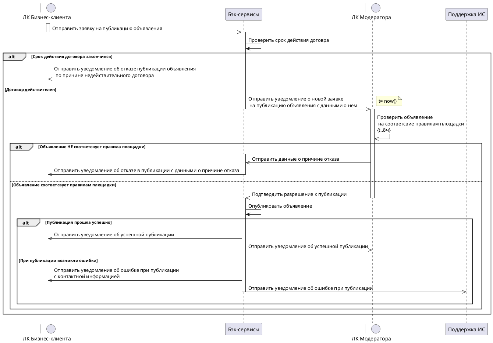

# Бизнес процесс
описание бизнес-процесса 

## Схема интеграции

## Описание участников процесса
табличка с указанием участника и его описание

## Описание технологий, используемых при реализации данной интеграции