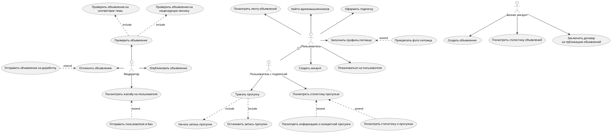

# Диаграмма вариантов использования

## Краткое описание каждого варианта использования

### Пользователь

#### Зарегистрировать профиль
Создать профиль пользователя в системе для дальнейшего использования системы пользователем

#### Заполнить профиль питомца
Заполнить профиль питомца информацией для более удобного поиска друзей для других пользователей.
Информация: кличка, фото, характеристики питомца.

### Бизнес-клиент

### Модератор

#### Опубликовать объявление
Разместить зарегистрированное объявление в ленте объявлений